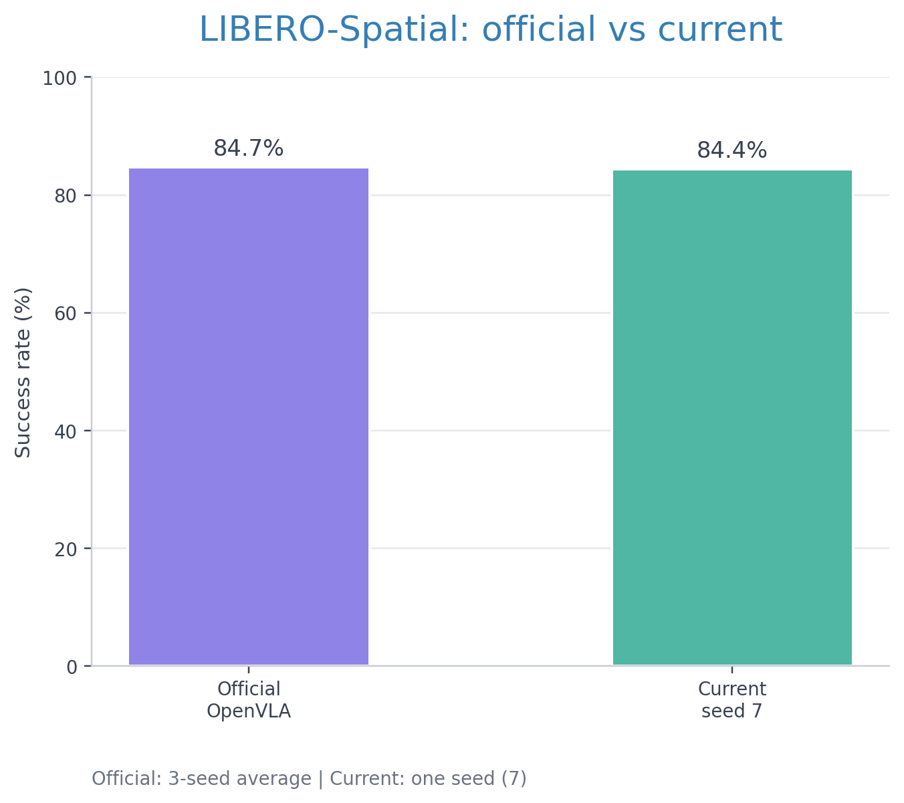
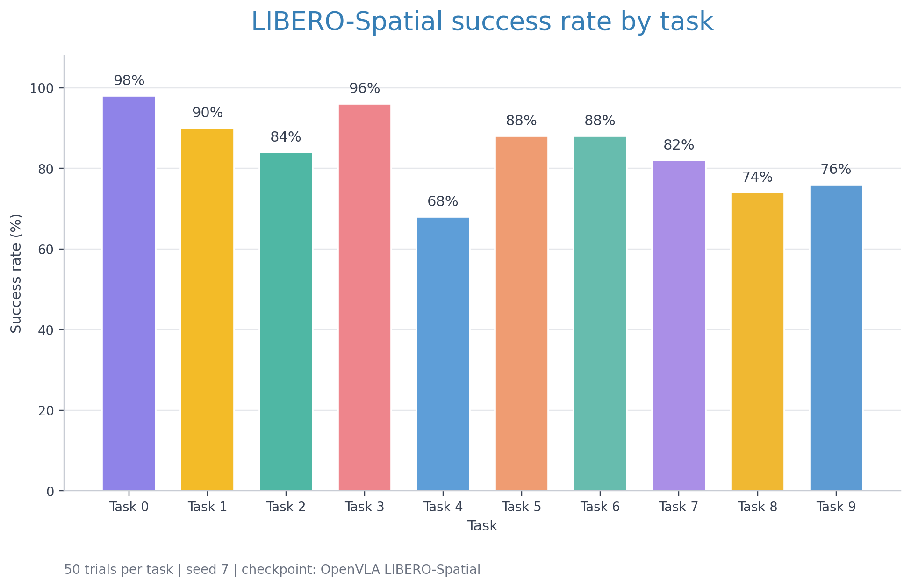
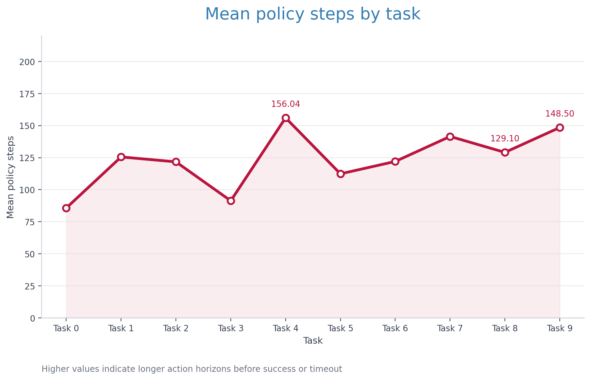
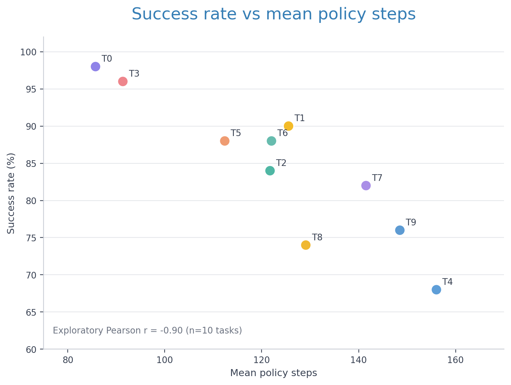

# LIBERO-Spatial 벤치마크 보고서

[English version](en/benchmark_report.md)

## 개요

LIBERO-Spatial 미세조정 체크포인트를 사용한 OpenVLA를 LIBERO-Spatial 태스크 모음의 10개 태스크에 적용하였다. 각 태스크는 시드 7에서 50회씩 평가하였다.

## 평가 프로토콜

- 체크포인트: `openvla/openvla-7b-finetuned-libero-spatial`
- 태스크 모음: `libero_spatial`
- 평가 횟수: 태스크별 50회, 총 500회
- 최대 평가 구간: 220 정책 스텝
- 초기 상태: LIBERO 태스크 초기 상태
- 이미지 해상도: 256
- Center crop: 사용
- 정책 입력: RGB 관측과 고정 태스크 지시문

## 종합 결과

총 500개 에피소드 중 422개가 성공하여 전체 성공률은 **84.4%**였다. 실패한 78개 에피소드는 모두 220 정책 스텝 제한에 도달하여 종료되었다. 태스크 로그에서 별도의 런타임 오류는 확인되지 않았다.

## 태스크별 결과

Task 0의 성공률이 98%로 가장 높았고, Task 4의 성공률이 68%로 가장 낮았다. Task 4의 평균 정책 스텝은 156.04로 전체 태스크 중 가장 높았다. Task 8과 Task 9의 성공률은 각각 74%와 76%였다.

태스크별 원자료는 [task_results.csv](../results/libero_spatial/openvla_7b_finetuned/seed_7/task_results.csv)에 저장되어 있다. 각 태스크의 JSON 요약과 로그는 동일한 시드 디렉터리 아래에 분리되어 있다.

## 공식 결과와의 비교

OpenVLA 공식 보고서의 LIBERO-Spatial 결과는 세 개의 랜덤 시드 평균인 **84.7 ± 0.9%**이다. 본 평가에서는 시드 7에서 **84.4%**가 측정되었으며, 두 결과의 차이는 0.3%p이다. 본 평가는 단일 시드 결과이므로 이 차이를 모델 성능 차이로 해석하지 않는다.

## 해석

이번 10개 태스크 비교에서는 평균 정책 스텝이 긴 태스크에서 성공률이 낮아지는 경향이 관찰되었다. 다만 태스크마다 물체 배치, 접근 방향, 공간 제약이 동시에 달라지므로 개별 요인의 영향으로 분리해 해석할 수 없는 탐색적 결과이다.

Task 4는 제약된 grasp 조건을 보여주는 대표적인 사례이다. 목표 bowl이 캐비닛 서랍 안에 있어 서랍 경계와 부분적인 가림이 접근 및 들어 올리기 가능한 자세를 제한한다. 목표 주변 물체와의 거리만으로 결과를 설명하기는 어렵다. 유사하게 bowl이 가까운 물체 사이에 배치되는 Task 0은 98%의 성공률을 기록했기 때문이다.

## 한계

- 단일 랜덤 시드 결과이다.
- 10개 태스크는 개별적인 기하학적 요인을 독립적으로 통제하지 않는다.
- 실패 분석은 모든 실패 에피소드가 아닌 대표적인 Task 4 궤적을 중심으로 작성하였다.
- 본 릴리스는 네이티브 LIBERO 성능만 다룬다. Isaac Sim 또는 실제 Franka로의 전이 결과는 별도의 평가 프로토콜이 필요하다.

## 참고 자료

- [OpenVLA 공식 README](https://github.com/openvla/openvla)
- [OpenVLA LIBERO 평가기](https://github.com/openvla/openvla/blob/main/experiments/robot/libero/run_libero_eval.py)
- [LIBERO 저장소](https://github.com/Lifelong-Robot-Learning/LIBERO)
