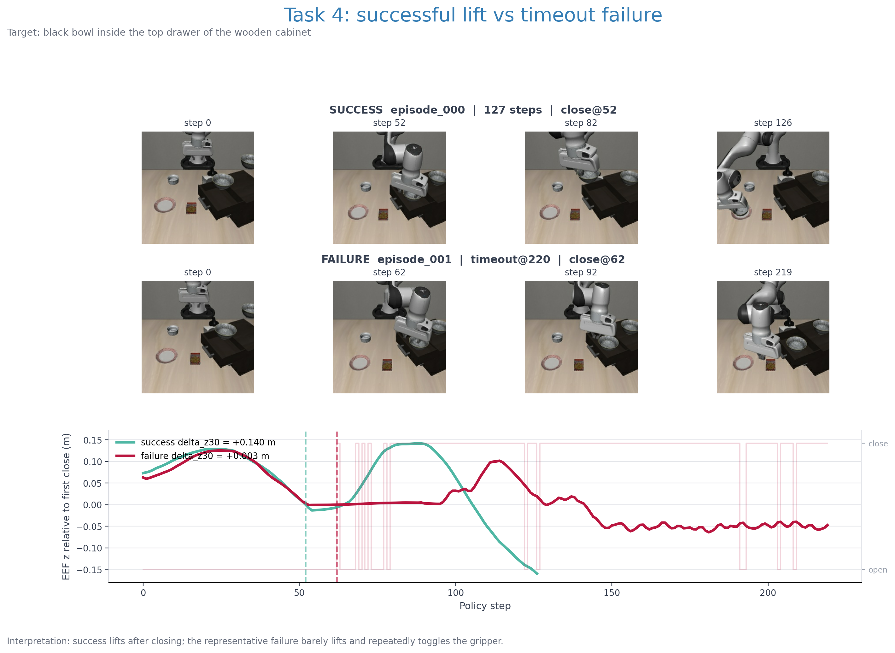

# Failure analysis: benchmark-only

## 1. 확인된 사실

- 전체 실패는 78회이며, 모두 reason=timeout, policy_steps=220이다.
- runtime Traceback, CUDA/OOM, 환경 초기화 오류는 확인되지 않았다.
- Task 4는 34/50 성공, 16/50 실패, 성공률 68%다.
- Task 4 성공 예시 episode_000, episode_004는 gripper close 이후 end-effector가 위로 이동하며 bowl을 들어 올린다.
- Task 4 실패 예시 episode_001은 gripper close 이후 30 step 동안 end-effector z 변화가 약 +0.003 m로 작고, 이후 gripper action이 반복적으로 전환된다. bowl을 안정적으로 들어 올리지 못한 채 timeout으로 끝난다.

원본 evidence는 다음에 있다.

- media/task_04/episode_000.mp4 — success
- media/task_04/episode_001.mp4 — timeout failure
- media/task_04/episode_004.mp4 — success
- 각 MP4와 대응하는 episode_*.npz — RGB, EEF pose, gripper/action, reward, termination metadata

## 2. Task 4에서 가장 강한 실패 가설

### A. drawer 경계와 제한된 grasp clearance

Task 4 instruction은 “top drawer of the wooden cabinet” 안의 bowl을 집으라는 내용이다. target 주변에 물체가 있다는 사실만이 아니라, gripper가 drawer opening을 통과하고 bowl의 옆면/상단에 접근할 수 있는 3차원 여유가 작다는 점이 중요하다.

### B. 부분 가림과 RGB 기반 위치 추정

OpenVLA evaluator는 RGB observation과 고정 instruction으로 action을 질의한다. drawer lip과 cabinet 구조가 bowl의 경계와 접근 방향을 가리면, 2D appearance가 비슷해도 안정적인 grasp point와 lift direction을 결정하기 어렵다.

### C. grasp 뒤 lift 검증 실패와 긴 horizon 누적

성공 episode는 close 이후 실제 lift가 발생하고, 이후 plate까지 이동한다. 실패 episode는 close 명령이 나온 뒤에도 lift가 거의 발생하지 않으며, 남은 220 step 예산을 소모한다. grasp가 처음부터 불안정하면 placement 단계까지 도달할 시간이 사라진다.

## 3. “가까운 object”만으로 설명할 수 없는 이유

Task 0은 bowl이 plate와 ramekin 사이에 있지만 98%다. 반면 Task 4는 drawer 내부에서 68%다. 따라서 다음처럼 해석해야 한다.

~~~text
nearby object
    + occlusion
    + constrained approach
    + container boundary
    + lift/transport clearance
    + long-horizon action accumulation
    -> failure probability
~~~

Task 8도 bowl이 plate 옆에 있어 74%지만, destination과 target이 동시에 가까워져 placement에서 충돌/접근 여유가 줄어드는 구조다. 이 비교는 “거리”보다 **접근 가능한 grasp/placement configuration의 수**가 더 유용한 설명 변수일 수 있음을 보여준다.

## 4. 다른 낮은 Task와의 비교

- **Task 4 — 68%:** top drawer 내부. 가장 강한 constrained-grasp 사례.
- **Task 8 — 74%:** plate 바로 옆. target과 destination이 동시에 좁다.
- **Task 9 — 76%:** wooden cabinet 위. 높이 차이와 cabinet edge를 넘어 plate로 이동한다.
- **Task 7 — 82%:** stove 위. 지지면과 이동 경로가 평평한 table과 다르다.
- **Task 0 — 98%:** 가까운 물체 사이지만 open table 위에서 접근과 lift가 상대적으로 쉽다.

이 순위는 task semantics와 geometry가 함께 바뀌는 단일 benchmark이므로, 원인을 분리한 실험이 아니라 failure-mode prioritization으로 기록한다.
